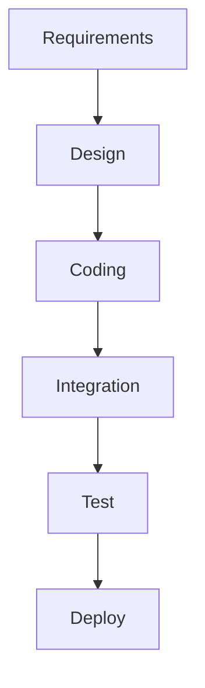

# **Introduction to agile philosophy**

## **Agile principles**
### <ins>What is Agile?</ins>
- Agile is an iterative approach to project management that allows teams to be responsive and deliver value to their customers faster.

- Unlike other planning approaches where we plan out an entire year's worth of work, with Agile we plan out small increments and they get feedback from the customer to see if they like what we're doing then making possible to adjust as we go along.

### <ins>Agile defining characteristics</ins>
- Agile emphasizes:
    
    - Adaptive planning which we don't plan out an entire year, but a small iteration to see if we can deliver something of value to the customer, get feedback and see what they like, allowing us to do evolutionary development.

    - Evolutionary development that will evolve over time. We are building... instead of building the whole thing up at once, we are building it in small increments and then evolving and responding as we go. This gives the opportunity to do early delivery.

    - Early delivery is a key component of being agile, in other words, if you are developing iterations and not delivering to the customer, you are not being agile. Putting something in the customers' hands, getting feedback from them to understand and see what they liked, should we pivot, should we persevere? This is a critical defining characteristic of being agile, over just doing iterative development.

    - Countinuous improvement is done as team. We continuously improve the product that we are delivering because we have the opportunity to get feedback from our customer, because we delivered it. This allow us to be responsive to change. So as changes happen (they always do), customers always have changing requirements. We can respond to those changes, because we haven't planned too far in advance, the customer sees the progress we have made and then we can quickly re-plan and be responsive to what a customer needs.

### <ins>Agile manifesto</ins>
- We have come to value:

    - **Individuals and interactions** over processes and tools
    - **Working software** over comprehensive documentation
    - **Customer collaboration** over contract negotiation
    - **Responding to change** over folowing a plan

> While there is value in the items on the right, we value the items on the left more. 
> 
> It does not mean we do not have processing tools, it just means that we value interacting amongst ourselves and with our customers more than the process and tools.
>
> It does not mean we do not document (it is important so that people understand how to use the product), but we can not ship documentation.
>
> Working software is what we are here to deliver. It does not mean that we don't negotiate contracts, we still have contracts, but we want to collaborate with the customer.
>
> As things change, we want to be responsive, which does not mean that we do not have plans, but we value responding to change over simply following the plan.

### <ins>Agile software development</ins>
- Is an interative approach to software development consistent with the Agile Manifesto.

- Emphasizes flexibility, interactivity (with peers and customer) and a high level of transparency, so that everybody knows what everyone else is working on and feels responsible for delivering value to the customers.

- Uses small, co-located, cross-functional, self-organizing teams.

### <ins>Key takeway</ins>
- Build what is needed, not what is planned. If you build what was planned and the customer does not like it, why bother? It is important to make sure that as they need change, you want to build what is needed from the customer regardless of what was planned. We can always replan and be responsive to change.

## **Methodologies overview**

### <ins>Traditional waterfall development</ins>

- Requirements: people are gathering requirements, seeing what the customer wants, making sure that we are going to deliver something that the customer wants. At least for that point in time. In short, this is a phase where all you are doing is documenting all the requirements of the customer might want in the system.

- Design: happens after getting all the requirements. The architects are designing, figuring out how do we take those requirements, turn them into working software. And so, they design the entire system.

- Coding: this phase is where the developers are coding away.

- Integration: all along, the coding phase was made in isolation and we are not integrating my module with the next person module, but there is a time when all the modules come together and then comes the question: "Do all these pieces of code even work together?". Then comes the testing phase

- Test: with a system that people can test, bugs are found, they go back and open some bugs in the coding phase and do some recoding. However it would be extremely hard to change anything if one of those bugs that they tested turns out to be a change in the design because nothing is interacting well.

- Deploy: Goes to production and is available to the customer.

> In a waterfall development, there is a exit and entrance criteria to move from on phase to the other and once you are in the coding phase, for example, and find out that the design is bad, it is real hard to go back up and redesign thing. In fact, because the software development is treated the same way as a civil engineer project, sometimes some of those designers have moved on to the next project, and you have got to find them. So it is very dificult to go back a phase in a waterfall development.

### <ins>Problems with the waterfall approach</ins>
- No provision for changing requirements. Every phase has entrance and exit criteria and when one ends, the next on begins. Also there is no provision for going back and changin the design or changing the requirements.

- No ideia if it works until the end, there is no intermediate delivery. Nothing is delivered until the last step, where we give to the operations team and say "go deliver this to prodution".

- Each step ends when next begins and each and every phase is an opportunity to lose information, have a mishap happen or to have people get blocked, because they can not accept the work from the previous phase and you are waiting to get the next phase going.

- Mistakes that are found later on are very costly. To find something that is designed wrong and testing and go back and redesign it.

- There is the long lead time, right between getting that sofware delivered. From the time you first want the software and you design, code, test it and, by the time it is delivered, there is a long lead time.

- Teams work separetely, unaware of their impact on each other. The designers, for example, are unaware of the impact of the code, the coders are unaware of their impact to integrating all the code together. In this approach, everybody is working in their little silos for their little phase. With this, people who are furthest away from a code, the operation team, have to run and manage the software in production (they know the lease about the code and are expected to run it).

### <ins>Extreme programming (XP)</ins>
- Kent Beck introduced Extreme Programming in 1996

> The graphic is very iterative and talking about loops. You've got these major release plan on the outer loop, then an iteration plan and so the release maybe months, the iterations maybe weeks, acceptance has maybe days, stand up meetings once a day, pair negotiation in hours, unit test in minutes, pair programming in seconds. It is tighter loops of doing work and getting feedback.

- It is based on iterative approach to software development and the intent is to improve sofware quality, be responsive to change, be responsive to customer requirements, do things in small increments.

- Extreme Programming can also be considered one of the first Agile methods.

### <ins>Extreme programming values</ins>
- Simplicity: keep it simple and do what you need and no more. Do not over-engineer, do not over code, do not deliver more code than the customer asked for.

- Communication: everyone on the team should be communicating to know what everyone else is doing.

- Feedback: the feedback loops are critical to extreme programming, and critical to Agile in general, since you have no idea how you are doing unless you are getting feedback.

- Respect: everyone feels that they are respected on the team, that they can offer advice that they can make suggestions and that their suggestions are just as valuable as anybody else's suggestion on the team. There is no hierarchy, everybody has peers on the team and respected for their ideas.

- Courage: be honest about your thoughts and the amount of work you can do without lying to overestimate yourself.

### <ins>Kanban</ins>
- Means billboard sign and it is all about continuous flow on the manufacturing floor, where these cards or notes would flow with the product from station to station, going down the line. The principle with this is to visualize the workflow

### <ins>Core principles of Kanban</ins>
- Visualize the workflow
- Limit work in progress (wip)
- Manage and enhance the flow
- Make process policies explicit
- Continuously improve

## **Working with Agile**
### <ins>Working Agile</ins>
- Working in small batches. Using lean manufacturing as an example, you do not want to make a batch of something and then find out that you did it wrong because that's a lot of wast having to go back and change it.

- Use minimum viable product (MVP) to figure out what does the customer like, what doesn't the customer like.

- Use practices like Behavior Driven Development and Test Driven Development to improve your testing of the system from the outside in and from the inside out.

- Take advantage of pair programming. This came from extreme programming, but pair programming is critically important.

### <ins>Working in small batches</ins>
- You need to mail 1000 brochures:
  - Step 1: fold brochures
  - Step 2: insert brochures into evelopes
  - Step 3: seal the envelopes
  - Step 4: Stamp the envelopes with postage

- Working in batches of 50 brochures
  - Assume each step takes 6 seconds to complete (10/min)
  

  - What if the envelopes had no glue?
  - What if there were a type in the brochure?

### <ins>Single piece flow</ins>
- Working in batches of 50 brochures:
  - Assuming each step takes 6 seconds to complete
  

  - What if the envelopes had no glue? Could be easily found out
  - What if there were a type in the brochure? Would be evident at the end of the first finish product in 24 seconds

> It is very important that we don't work in two larger batches so that we can get fast feedback and that we can pivot and understand we need something different and then make the changes that we need to make.

### <ins>Minimum Viable Product</ins>
- Minimum Viable Product (MVP) is not the result of "Phase 1" of a project, the first beta or something like that.

- **Minimum Viable Product (MVP) is the minimum thing that you can do to prove a hypothesis and gain learning and gain understanding**.

- There difference between these two items is that the first one is all about delivery "What am I going to deliver?", but the second on is all about learning "What can I learn?" and "What can I learn from putting out this MVP and get feedback and then maybe make the next one even better?". So it is important that at the end of each MVP you decide whether to pivot or persevere.

- Example: Here's a team that's developing a minimum viable product for a customer that wants a car. And so, in the first iteration, they deliver a wheel. The customer's like, "What am I going to do with a wheel? I can't do anything with this?" Like, well, we're working iterations, we're trying to be agile here, right? And so the next iteration, we'll give you some more. And they give them a chassis and it's like, okay, "I really can't do anything with this." And then finally, you know, they give them a car with no steering wheel and then eventually they get the car, right? And so they get this coupe. That team did not understand how to create a minimum viable product. They were just doing iterative development. The second team understands the value of creating an MVP. At first, they give them a skateboard and the customer's like, "I asked you for a car and you're giving me a skateboard." Whoa, whoa we're testing the color. How do you like that color red? Is that the color you want? "Oh yeah, red's kind of cool but you know it's really hard to steer." No, we'll fix that in the next MVP and then they add a way to steer it and the customer's like, "Well, okay, you did give me a way to steer it but I can't go very fast. I need a better form of locomotion." And then we'll deal with that in the next MVP. In the next iteration, they give them pedals. Somewhere along the way while the customer is riding on that motorcycle feeling the wind in their hair they decide, "I want a convertible." In the first instance, the customer got exactly what they asked for months before because they were just following a plan but in the second instance the customer got exactly what they desired because they were working interactively with the development team and in the end, you develop something that's a little bit different but it's closer to what the customer really, really wants.

### <ins>Behavior Driven Development (BDD)</ins>
- Behavior Driven Development is when we describe the system from the outside in. This is usually done at an integration testing level.

- This is where we are taking the customer's view of the system. Usually when you are doing BDD testing, you are doing it against the user interface; you are doing it against the thing that the customer sees to see if the system behaves the way it is supposed to. So, if it is an e-commerce system, when I put something in my cart, does it behave the way I want? When I transfer a cart to an order, does it behave the way I want? It is really taking an outside-in approach. It is not too concerned with the things going on underneath.

- It uses a single syntax that both the developers and the stakeholders can use to describe the system and agree on the behavior of the system, on what the system does.

### <ins>BDD feature scenarios</ins>
- "As a < role >. I need some < function >. So that < some business value >"

- So, now you know who is it for. Is it for the customers? For the system administrator,? Who's getting the value out of this what do they need and why do they need it? And that's the beginning of your feature file. And then you start running through scenarios and here's where we use this common syntax known as Gherkin syntax, after the Gherkin pickle. And it goes something like this:
  - Given a set of preconditions (sets up the scenario - given that this is true)
  - When some event occurs (the thing that is under test)
  - Then some outcome is observable

> Using this <ins>given when-then</ins> syntax, developers can understand it, stakeholders can understand it, everybody can understand this common syntax that when I have something in my cart, for example, and then I clear my cart, I should see nothing in my cart. So very, very important to have the syntax in these BDD scenarios.

### <ins>Test Driven Development (TDD)</ins>
- Test driven development is testing a system from the inside out. Unlike Behavior Driven Development, TDD is concerned with the internals of the system, the single modules. Usually this is called unit testing and is something that is unit test case driven and we want to make sure that given these inputs I get these outputs at a small module level.

- It is not known if when I put them all together I am going to get the behavior I want, that is BDD, but for TDD I am just testing the system way down at the unit level and so a test case is written first for the code you wish you had and then you write enough code to make that test case pass, and then you start all over again and refactor. This should be the workflow for TDD:
  - I write a test case: it is done before the code. This keeps you featured on what the code is supposed to do, how you want to call it, what are the parameters and what does it do.
  - So you write the test case first, then you write the code to make that test case pass and then, once it passes, then you can refactor the code because now you have test cases to keep it honest.

- Because when the test case runs and it fails, it usually turns red and then when it works correctly it turns green. This is called Red, Green, Refactor -> whatch a test case, write a test case, watch it fail, make just write enough code to make it pass and then refactor.

### <ins>Pair programming</ins>
- Two programmers work together at on workstation
  - One writes the code
  - The other reviews each line of code as it is typed in.

- Having two sets of eyes, they check each other and they go back and forth, making it possible to find bugs while writting the code. But this is not just one and then the other. The two programmers switch roles fequently (e.g. 20 minutes).

- Code quality increases as defects are found earlier.

- It is a good practice to pair a senior programmer with a junior programmer. This make it possible for a junior programmer to see how a senior programmer approaches the problem. So they learn, they get mentorship, and then the senior programmer can see how the junior person is making out. Or you get prople who are unfamiliar with the code working with someone who is and, with this, you get more people learning the code.

# **Introduction to scrum methodology**

# **Organizing for success**