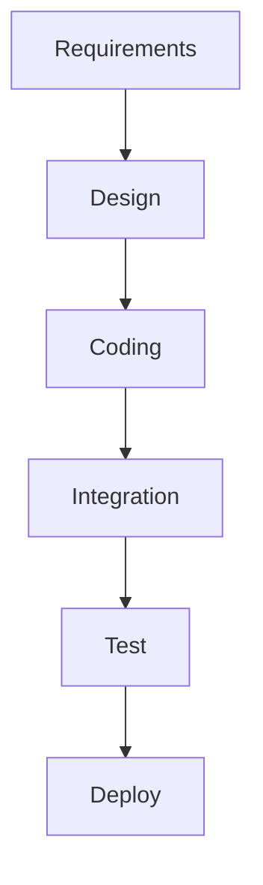

# **Introduction to agile philosophy**

## **Agile principles**
### <ins>What is Agile?</ins>
- Agile Development is a software development methodology that emphasizes flexibility, collaboration, and customer satisfaction. It involves iterative development, where requirements and solutions evolve through the collaborative effort of self-organizing and cross-functional teams.

- Unlike other planning approaches where an entire year's worth of work is planned out, with Agile, small increments are planned and feedback from the customer is received to see if they are satisfied with the work done. This allows adjustments to be made along the way.

### <ins>Agile defining characteristics</ins>
- Agile emphasizes:
    
    - Adaptive planning where a small iteration is planned to see if something of value can be delivered to the customer. This allows for evolutionary development.

    - Evolutionary development that evolves over time, building the product in small increments and responding to feedback. This allows for early delivery.

    - Early delivery is a key component of being agile. If iterations are being developed but not delivered to the customer, then it is not agile. Putting something in the customers' hands and getting feedback from them is critical for understanding what they like and need, and whether to pivot or persevere.

    - Continuous improvement is done as a team. The product is continuously improved based on feedback from the customer, allowing for responsiveness to change. As changes happen and customer requirements evolve, the team can quickly re-plan and be responsive to what the customer needs.

### <ins>Agile manifesto</ins>
- We have come to value:

    - **Individuals and interactions** over processes and tools
    - **Working software** over comprehensive documentation
    - **Customer collaboration** over contract negotiation
    - **Responding to change** over following a plan

> "While there is value in the items on the right, we value the items on the left more.
>
> This does not mean we do not use process tools, but we prioritize interacting with ourselves and our customers more than the tools and processes.
>
> It does not mean we do not document, as documentation is important for people to understand how to use the product, but we do not prioritize shipping documentation over working software.
>
> Working software is the primary goal of Agile development. We still negotiate contracts, but we prioritize collaborating with the customer to ensure satisfaction.
>
> While we still have plans, we prioritize being responsive to changes over simply following the plan. This allows us to adapt quickly to changing customer requirements and deliver a better product."

### <ins>Agile software development</ins>
- Agile software development is an iterative and interactive approach to software development that emphasizes flexibility, collaboration, and customer satisfaction. It is consistent with the Agile Manifesto.

- Agile development involves frequent feedback from the customer to ensure that the software being developed is aligned with their needs. This approach emphasizes interactivity with peers and customers, as well as a high level of transparency, so that everyone involved in the project knows what is being worked on and feels responsible for delivering value to the customer.

- Agile development uses small, co-located, cross-functional, self-organizing teams. These teams are empowered to make decisions and manage their own work, and they work closely with the customer to ensure that the software being developed meets their needs. Agile development also emphasizes continuous improvement, with the team regularly reflecting on their processes and making changes to improve their efficiency and effectiveness.

### <ins>Key takeaway</ins>
- Agile development emphasizes building what is needed, not what is planned. By delivering small increments of working software and gathering feedback from the customer, the development team can ensure that they are building software that meets the customer's needs. This approach allows for flexibility and responsiveness to change, so the team can adjust their plans and priorities as necessary to deliver value to the customer. Ultimately, the goal is to build software that provides the most value to the customer, rather than adhering strictly to a pre-defined plan.

## **Methodologies overview**

### <ins>Traditional waterfall development</ins>

- Requirements: people are gathering requirements, seeing what the customer wants, making sure that we are going to deliver something that the customer wants. At least for that point in time. In short, this is a phase where all you are doing is documenting all the requirements of the customer might want in the system.

- Design: happens after getting all the requirements. The architects are designing, figuring out how do we take those requirements, turn them into working software. And so, they design the entire system.

- Coding: this phase is where the developers are coding away.

- Integration: all along, the coding phase was made in isolation and we are not integrating my module with the next person module, but there is a time when all the modules come together and then comes the question: "Do all these pieces of code even work together?". Then comes the testing phase

- Test: with a system that people can test, bugs are found, they go back and open some bugs in the coding phase and do some recoding. However it would be extremely hard to change anything if one of those bugs that they tested turns out to be a change in the design because nothing is interacting well.

- Deploy: Goes to production and is available to the customer.

> In a waterfall development, there is a exit and entrance criteria to move from on phase to the other and once you are in the coding phase, for example, and find out that the design is bad, it is real hard to go back up and redesign thing. In fact, because the software development is treated the same way as a civil engineer project, sometimes some of those designers have moved on to the next project, and you have got to find them. So it is very difficult to go back a phase in a waterfall development.

### <ins>Problems with the waterfall approach</ins>
- No provision for changing requirements. Every phase has entrance and exit criteria and when one ends, the next on begins. Also there is no provision for going back and changing the design or changing the requirements.

- No idea if it works until the end, there is no intermediate delivery. Nothing is delivered until the last step, where we give to the operations team and say "go deliver this to production".

- Each step ends when next begins and each and every phase is an opportunity to lose information, have a mishap happen or to have people get blocked, because they can not accept the work from the previous phase and you are waiting to get the next phase going.

- Mistakes that are found later on are very costly. To find something that is designed wrong and testing and go back and redesign it.

- There is the long lead time, right between getting that software delivered. From the time you first want the software and you design, code, test it and, by the time it is delivered, there is a long lead time.

- Teams work separately, unaware of their impact on each other. The designers, for example, are unaware of the impact of the code, the coders are unaware of their impact to integrating all the code together. In this approach, everybody is working in their little silos for their little phase. With this, people who are furthest away from a code, the operation team, have to run and manage the software in production (they know the lease about the code and are expected to run it).

### <ins>Extreme programming (XP)</ins>
- Kent Beck introduced Extreme Programming in 1996

> The graphic is very iterative and talking about loops. You've got these major release plan on the outer loop, then an iteration plan and so the release maybe months, the iterations maybe weeks, acceptance has maybe days, stand up meetings once a day, pair negotiation in hours, unit test in minutes, pair programming in seconds. It is tighter loops of doing work and getting feedback.

- It is based on iterative approach to software development and the intent is to improve software quality, be responsive to change, be responsive to customer requirements, do things in small increments.

- Extreme Programming can also be considered one of the first Agile methods.

### <ins>Extreme programming values</ins>
- Simplicity: keep it simple and do what you need and no more. Do not over-engineer, do not over code, do not deliver more code than the customer asked for.

- Communication: everyone on the team should be communicating to know what everyone else is doing.

- Feedback: the feedback loops are critical to extreme programming, and critical to Agile in general, since you have no idea how you are doing unless you are getting feedback.

- Respect: everyone feels that they are respected on the team, that they can offer advice that they can make suggestions and that their suggestions are just as valuable as anybody else's suggestion on the team. There is no hierarchy, everybody has peers on the team and respected for their ideas.

- Courage: be honest about your thoughts and the amount of work you can do without lying to overestimate yourself.

### <ins>Kanban</ins>
- Means billboard sign and it is all about continuous flow on the manufacturing floor, where these cards or notes would flow with the product from station to station, going down the line. The principle with this is to visualize the workflow

### <ins>Core principles of Kanban</ins>
- Visualize the workflow
- Limit work in progress (wip)
- Manage and enhance the flow
- Make process policies explicit
- Continuously improve

## **Working with Agile**
### <ins>Working Agile</ins>
- Working in small batches. Using lean manufacturing as an example, you do not want to make a batch of something and then find out that you did it wrong because that's a lot of wast having to go back and change it.

- Use minimum viable product (MVP) to figure out what does the customer like, what doesn't the customer like.

- Use practices like Behavior Driven Development and Test Driven Development to improve your testing of the system from the outside in and from the inside out.

- Take advantage of pair programming. This came from extreme programming, but pair programming is critically important.

### <ins>Working in small batches</ins>
- You need to mail 1000 brochures:
  - Step 1: fold brochures
  - Step 2: insert brochures into envelopes
  - Step 3: seal the envelopes
  - Step 4: Stamp the envelopes with postage

- Working in batches of 50 brochures
  - Assume each step takes 6 seconds to complete (10/min)
  

  - What if the envelopes had no glue?
  - What if there were a type in the brochure?

### <ins>Single piece flow</ins>
- Working in batches of 50 brochures:
  - Assuming each step takes 6 seconds to complete
  

  - What if the envelopes had no glue? Could be easily found out
  - What if there were a type in the brochure? Would be evident at the end of the first finish product in 24 seconds

> It is very important that we don't work in two larger batches so that we can get fast feedback and that we can pivot and understand we need something different and then make the changes that we need to make.

### <ins>Minimum Viable Product</ins>
- Minimum Viable Product (MVP) is not the result of "Phase 1" of a project, the first beta or something like that.

- **Minimum Viable Product (MVP) is the minimum thing that you can do to prove a hypothesis and gain learning and gain understanding**.

- There difference between these two items is that the first one is all about delivery "What am I going to deliver?", but the second on is all about learning "What can I learn?" and "What can I learn from putting out this MVP and get feedback and then maybe make the next one even better?". So it is important that at the end of each MVP you decide whether to pivot or persevere.

- Example: Here's a team that's developing a minimum viable product for a customer that wants a car. And so, in the first iteration, they deliver a wheel. The customer's like, "What am I going to do with a wheel? I can't do anything with this?" Like, well, we're working iterations, we're trying to be agile here, right? And so the next iteration, we'll give you some more. And they give them a chassis and it's like, okay, "I really can't do anything with this." And then finally, you know, they give them a car with no steering wheel and then eventually they get the car, right? And so they get this coupe. That team did not understand how to create a minimum viable product. They were just doing iterative development. The second team understands the value of creating an MVP. At first, they give them a skateboard and the customer's like, "I asked you for a car and you're giving me a skateboard." Whoa, whoa we're testing the color. How do you like that color red? Is that the color you want? "Oh yeah, red's kind of cool but you know it's really hard to steer." No, we'll fix that in the next MVP and then they add a way to steer it and the customer's like, "Well, okay, you did give me a way to steer it but I can't go very fast. I need a better form of locomotion." And then we'll deal with that in the next MVP. In the next iteration, they give them pedals. Somewhere along the way while the customer is riding on that motorcycle feeling the wind in their hair they decide, "I want a convertible." In the first instance, the customer got exactly what they asked for months before because they were just following a plan but in the second instance the customer got exactly what they desired because they were working interactively with the development team and in the end, you develop something that's a little bit different but it's closer to what the customer really, really wants.

### <ins>Behavior Driven Development (BDD)</ins>
- Behavior Driven Development is when we describe the system from the outside in. This is usually done at an integration testing level.

- This is where we are taking the customer's view of the system. Usually when you are doing BDD testing, you are doing it against the user interface; you are doing it against the thing that the customer sees to see if the system behaves the way it is supposed to. So, if it is an e-commerce system, when I put something in my cart, does it behave the way I want? When I transfer a cart to an order, does it behave the way I want? It is really taking an outside-in approach. It is not too concerned with the things going on underneath.

- It uses a single syntax that both the developers and the stakeholders can use to describe the system and agree on the behavior of the system, on what the system does.

### <ins>BDD feature scenarios</ins>
- "As a < role >. I need some < function >. So that < some business value >"

- So, now you know who is it for. Is it for the customers? For the system administrator,? Who's getting the value out of this what do they need and why do they need it? And that's the beginning of your feature file. And then you start running through scenarios and here's where we use this common syntax known as Gherkin syntax, after the Gherkin pickle. And it goes something like this:
  - Given a set of preconditions (sets up the scenario - given that this is true)
  - When some event occurs (the thing that is under test)
  - Then some outcome is observable

> Using this <ins>given when-then</ins> syntax, developers can understand it, stakeholders can understand it, everybody can understand this common syntax that when I have something in my cart, for example, and then I clear my cart, I should see nothing in my cart. So very, very important to have the syntax in these BDD scenarios.

### <ins>Test Driven Development (TDD)</ins>
- Test driven development is testing a system from the inside out. Unlike Behavior Driven Development, TDD is concerned with the internals of the system, the single modules. Usually this is called unit testing and is something that is unit test case driven and we want to make sure that given these inputs I get these outputs at a small module level.

- It is not known if when I put them all together I am going to get the behavior I want, that is BDD, but for TDD I am just testing the system way down at the unit level and so a test case is written first for the code you wish you had and then you write enough code to make that test case pass, and then you start all over again and refactor. This should be the workflow for TDD:
  - I write a test case: it is done before the code. This keeps you featured on what the code is supposed to do, how you want to call it, what are the parameters and what does it do.
  - So you write the test case first, then you write the code to make that test case pass and then, once it passes, then you can refactor the code because now you have test cases to keep it honest.

- Because when the test case runs and it fails, it usually turns red and then when it works correctly it turns green. This is called Red, Green, Refactor -> watch a test case, write a test case, watch it fail, make just write enough code to make it pass and then refactor.

### <ins>Pair programming</ins>
- Two programmers work together at on workstation
  - One writes the code
  - The other reviews each line of code as it is typed in.

- Having two sets of eyes, they check each other and they go back and forth, making it possible to find bugs while writing the code. But this is not just one and then the other. The two programmers switch roles frequently (e.g. 20 minutes).

- Code quality increases as defects are found earlier.

- It is a good practice to pair a senior programmer with a junior programmer. This make it possible for a junior programmer to see how a senior programmer approaches the problem. So they learn, they get mentorship, and then the senior programmer can see how the junior person is making out. Or you get people who are unfamiliar with the code working with someone who is and, with this, you get more people learning the code.

# **Introduction to scrum methodology**

## **Scrum overview**

### <ins>Agile and Scrum</ins>
- There is a difference between agile and scrum, but they are words that many people use interchangeably.

- Agile is a philosophy, not prescriptive. It is a philosophy for doing work.

- Scrum is methodology, a prescriptive (adds process). It is a methodology for working in an agile fashion.

### <ins>Scrum</ins>
- **Scrum is a management framework for doing incremental product development emphasizing small, cross functional, self managing teams providing structure of roles, rules and artifacts. It uses these fixed length increments that are called sprints and has a goal of building an increment each time through a sprint, a potentially shippable increment each time through that iteration.**

### <ins>Sprint</ins>
- A sprint is one iteration through the design, code, test and deploy cycle. It is kind of like the software delivery lifecycle in a mini inner iteration.

- Every sprint should have a goal. In other words, everybody should understand what is it we are trying to build with this increment. What should this increment do at the end of the sprint?

- Sprints are usually 2 weeks in duration

### <ins>Steps in the Scrum process</ins>

-  Product backlog: this is the list of all the stories of everything you ever want to do with your product, like a to-do list of everything you might want to do.

- Backlog refinement: it is when we go through the product backlog and groom the stories to make sure that they are sprint ready because we want to start doing planning on those stories.

- Panning meeting: where we produce a sprint backlog. An observation is that the sprint backlog is smaller than the product backlog. The sprint backlog is just those stories that we want to accomplish in the next sprint, in the next two weeks. 

- So we take from that product backlog, pare it down into a sprint backlog of just the stories to execute in the next sprint and start the two weeks sprint. And every day we get together and do the daily Scrum or the daily stand-up where everybody gets to answer three questions.
  - What did you do yesterday?
  - What are you going to do today?
  - Is there anything blocking you or impeding you from getting up further?

- So you go through that every day for two weeks, build your sprint and then, hopefully, you've got a valuable shippable increment at the end of that process.

### <ins>Agile development is iterative</ins>

- You are going through the steps of design, code, test, deploy repeatedly and, with each iteration you get some king of feedback.

- In every sprint you make a plan, you go through the software delivery lifecycle cycle and then you deploy that application and get some feedback from the customer that is input to the next plan to go through the next cycle.

## **The 3 roles of Scrum**

### <ins>Scrum roles</ins>
- Product Owner: the person who has the vision and the one who calls the shorts. They are the ones who decides to pivot or persevere. But what is the difference between a product owner and a product manager? A product manager is a job title while a product owner is a Scrum role. Your product manager might be your product owner, or not. In essence, is a Scrum role.

- Scrum master: they are the mentors, the ones who are the smartest about Scrum on the team to help the rest of the team implement Scrum. Is somebody that you want to be guiding the team. Highly recommended if the team is not an experienced team.

- Scrum team (development team): are people who are developing whatever it is you are delivering. They could be software engineers, testers, operations folks, business analysts, whoever it is that is part of the team that is delivering the product increment.

### <ins>Product Owner</ins>
- Represents the stakeholder interests (if there is any doubt about what the stakeholder wants, the product owner should know)

- It is the person with the checkbook, the person who is funding whatever it is that you are doing. They are the one at the end of the day that are paying you to do it.

- Is a liaison between the Scrum team and the stakeholders and their interests

- They also articulate the product vision and have to have a vision of where they are going. And when and they should articulate that vision to the team, so the whole team knows where they are going.

- They are the final arbiter of requirements or questions and constantly reprioritize the product backlog, adjusting expectations as needed. So every time we go through a sprint, the product backlog is reviewed by the product owner and possibly the Scrum master. They reprioritize and groom the stories, providing more details as necessary.

- The job of the product owner is to make sure that the backlog is sprint ready and accept, or reject, each product increment. They decide whether to continue development or pivot.

### <ins>Scrum master</ins>
- Facilitates the scrum process. They should be the smartest person in the room about Scrum. It is very important to have an experienced Scrum master if you have an inexperienced team. if you have a very experienced team in Scrum, you might not need a very experienced Scrum master. Or you might have a Scrum master between a couple of teams that are experienced because they don't need a lot of his time.

- They coach the team (the are Agile coaches). We want them to be mentors, we want them to help the team through the Scrum process. They create an environment that allows the team to be self organizing so the team decides what they do. They are the ones that are going to commit to a sprint increment and has to make sure that the team has the ability and the environment in which they can do that and be self-organizing. They also shield the team from external interferences like if the customers are grabbing team members or stakeholders, or calling team members. Basically, the Scrum master says "If you need something, you come to me. Let the team alone and work on what they need to work".

- The Scrum master also helps to resolve impediments. If there is any impediment preventing the team from completing their work as described during the daily stand-up, it is the Scrum master's highest priority to unblock the team and remove the impediment. This is different from traditional project management, where a project manager may simply ask what you will do about an impediment. In Scrum, the Scrum master takes ownership of the impediment and works to resolve it so the team can move on to more productive work.

- They enforce the sprint time boxed, for example, if a there is only 15 minutes for a daily stand-up, it is their job to make sure it stays 15 minutes and the two week sprint is not longer than those two weeks.

- They capture empirical data, which may include forecasts. Their role is to ensure that the team is on track to reach their goals by reviewing burn-down charts and other metrics. Although they have no management authority over the team, they should be someone that the team can confide in.

### <ins>Scrum team</ins>
- This is a cross-functional team consisting of developers, testers, business analysts, domain experts, and operations personnel (if doing DevOps).

- The Scrum team is self-organizing, self-managing, and self-assigns work. There are no externally assigned roles, and everyone is equal with the same role.

- The Scrum team pulls work from the Kanban board, assigns it to themselves, and begins working on it. They are self-managing, but the team should not be too large. A Scrum team should be around seven people, with two collaborative members.

- The team should be co-located, if possible, and is most successful when working together in the same room. If the team is geographically dispersed, at least two members should be in the same geography or time zone so they can collaborate effectively.

- The team should be dedicated, with long-term, full-time members who are not working on multiple projects.

- The team negotiates commitments with the product owner one sprint at a time, rather than making commitments for work too far in the future. They have autonomy in how they reach these commitments and should be told what needs to be done, rather than how to do it. Allow the team to figure out how to get the work done, as they are capable and skilled professionals.

## **Artifacts, events and benefits**

### <ins>Scrum artifacts</ins>
- Product backlog: this is a list of all the stories you're ever going to do. It's all your requirements for the product that haven't been done yet so any stories that not in the current sprint are in the product backlog. Some teams have the product backlog, an icebox and a release backlog.

- Sprint backlog: are the stories that you're going to do in the next two weeks in the sprint. So those are stories that are kind of on deck to be executed.

- Done increment: is product increment that is completed by the end of a sprint.

### <ins>Scrum events</ins>
- Sprint planning meeting: where you get together to plan out the sprint. In that meeting, you'll have the product owner and the Scrum master and the entire team planning out what to do next; where the team commits to the stories that they are going to fulfill in the next sprint.

- Daily scrum meeting (a.k.a. daily stand-up): it happens every day, usually in the same place, same time, where they meet to kind of synchronize on how things are going, what the team will work on that day and if there are any impediments that can be relieved by the Scrum master.

- Sprint review: it is when you demonstrate what you have done to the stakeholders so they could see the advancements that you've gotten, the new features that you've put in the product.

- Sprint retrospective: is where the team reflects on what went well, what did not and what can be changed for the future.

### <ins>Scrum benefits</ins>
- Higher productivity: when everybody is meeting ever day to understand what to do when we've got a Kanban board, with all our work in progress, everyone can see what everyone's working on. It lends itself to higher productivity, because people are kind of self-managing and being very productive. 

- Better quality: better software quality because the team is engaged in what they are doing. They are running tests, they are using behavior driven development, they're using test driven development and getting higher quality out of their, out of their code that they are writing because they are constantly testing it.

- Reduced time to market: because you are working with small increments and getting something done. In other words, you get a done increment sooner than you can then put out, have customers test enjoy.

- Increase stakeholder satisfaction: because they are not waiting months to see if whatever you build is what they want, but get to see it much quicker.

- Better teams dynamics: because it is transparent. Everyone knows what everyone is working on. Everybody chips in when somebody gets stuck. It is a better and productive environment for developer to work in.

- Happier employees: they understand they are in control and are pulling things off the backlog. They are committing to a sprint, one sprint plan at a time, and so they feel more in control and happier about their jobs.

### <ins>Scrum vs. Kanban</ins>

|                     	|                                     **Scrum**                                    	|                **Kanban**                	|
|---------------------	|:--------------------------------------------------------------------------------:	|:----------------------------------------:	|
| Cadence             	| Fixed length sprint                                                              	| Continuous flow                          	|
| Release methodology 	| End of each sprint                                                               	| Continuous delivery                      	|
| Roles               	| Product Owner, Scrum Master, Development Team                                    	| No existing roles (optional Agile coach) 	|
| Key metrics         	| Velocity (how much work can be done in two weeks)                                	| Cycle time                               	|
| Change philosophy   	| Teams should strive to not make changes to the sprint forecast during the sprint 	| Change can happen any time               	|

# **Organizing for success**

## **Organization impact of Agile**

### <ins>Organize for success</ins>
- Proper organization is critical to success

- Existing teams may need to be reorganized in order to take full advantage of becoming agile.

### <ins>Conway's law</ins>
- "Any organization that designs a system (defined broadly) will produce a design whose structure is a copy of the organization's communication structure." (Melvin Conway, Datamation, 1968).

- Example: If you ask an organization with four teams to write a compiler -> you will get a 4-pass compiler.

### <ins>How teams should be aligned</ins>
- Teams are loosely coupled, tightly aligned. You want them to be loosely coupled and you don't want a lot of dependency between teams, but you want the teams to be aligned, because they are building a single application. 

- The teams in an organization should have their own missions and objectives that align with the overall business goals, similar to a mini startup. For example, if an e-commerce platform is being developed with 50 developers, it is advisable to divide them into smaller teams based on the ownership of business areas, rather than having them work as a large team in a monolithic pattern. These teams could include an order team, an accounts team, a shopkart team, and a recommendation team, among others, each with a specific focus on their respective area of the business.

- Each team should have end-to-end responsibility, since you want them to build the application, run it and debug it in production.

- The team should have a long term mission. The long-term mission is usually around a single business domain.

### <ins>Autonomy is important</ins>
- It's motivating - and motivated people build better stuff.

- It's fast - decisions happen locally in the team level rather than waiting for decisions to come down on high.

- It minimizes handoffs and waiting, so teams don't get bogged down. The get to make their own decisions and get to run at their on speed.

### <ins>The agile dilemma</ins>

- This graphic, the wall of confusion, was made famous by Andrew Clay Schafer, but it's all about the diametrically opposed metrics that we use with development and operations. Development wants change, they are measured on getting new changes out into production. Whereas operations are measured on stability. 

- These are diametrically opposed views.

### <ins>The entire organization must be Agile</ins>

- The organization doesn't become Agile. It doesn't matter that your development team is Agile, if the DevOps team is not.

- In this case, the project was waiting for a ticket to be completed so the application could be deployed.

### <ins>Agile + DevOps = Alignment</ins>
|     **The goal of Agile**     	|                                 **The goals of DevOps**                                 	|
|:-----------------------------:	|:---------------------------------------------------------------------------------------:	|
| Develop software faster       	| Accelerate time to market                                                               	|
| Be responsive to changes      	| Improve IT's value by more closely aligning development, IT operations and the business 	|
| Obtain higher quality results 	| Increase IT productivity                                                                	|

## **Mistaking iterative development for Agile**
### <ins>Overview</ins>

- Agile is more than just iterative development and describe what Agile is not.

- Following is a pitfall that a lot of organizations fall into
  - They claim that they are Agile and start a new project. So they've got this studying and approval going on this design and planning. This is the "fuzzy front end".

    

  - They are doing the waterfall process and just building requirements. In short, they are doing a lot of planning, upfront stuff that doesn't really seem Agile, then they get it doing the actual development.
  
  - They are also being iterative. They are iterating on the plan, but just that and nothing else. They are not stopping at the end of each iteration to get feedback from the customer because they haven't deployed anything. They are not stopping at the end of each iteration and asking "Should I pivot or persevere?". In short, they are just following a plan iterating.
  
  - There is also the last mile where they are trying to deploy it and it takes forever to deploy because nobody's ever deployed before. This is the first time everything's been integrated together.

    
  
  - They are just doing waterfall with they think they're doing a Scrum in the middle. They are not really doing Scrum, but they are just doing iterative development.

  - This is a pitfall a lot of companies fall into, not being Agile. If a company is doing all this planning upfront, they're not being Agile, they're not going to be responsive to change, they're not going to be getting fast feedback unless they're deploying quickly.

### <ins>Agile is not...</ins>
- Agile is not a new version of a waterfall software development life cycle (SDLC) where you do legacy development in sprints.

- Agile is not just the developers working in each sprint. It involves a cross-functional team.

- The Agile manifesto does not include the term "Agile project management" (and so there are no "project managers" in Agile).

# **Planning to be agile**

## **Destination Unknown**
### <ins>Deadlines</ins>
- "I love deadlines... I like the whooshing sound they make as they fly by" (Douglas Adams)

- How to avoid missing a deadline?

### <ins>Plan iteratively</ins>
- Don't decide everything at the point when you know the least. In other words, at the beginning of project, we know practically nothing, or very little about the project and this is the moment the planning stage happens. So, we should not decide everything in the beginning, when we know the least, but plan for what you know and then adjust the plan as you move along. In short, do iterative planning, what Agile is all about.

- Your estimates will be more accurate, because the shorter time to plan, the more accurate the plan will be.

> Don't try to be omnipotent an plan everything up front, but plan as you go and as you learn more, than you could add more to the plan and get greater estimates.

## **Agile Roles and the Need for Training**
### <ins>Formulas for failure</ins>
- Product manager becomes product owner: placing people in a new role without giving them training. (Product manager is a job title and product owner, a scrum role. They may, or may not, be the same person)

- Project manager becomes the scrum master with no training on how to be the scrum master.

- Developers (alone) become scrum team. Developers alone are just the software engineers, so there are no tester, or ops people, or business analyst on the team.

### <ins>Product manager vs product owner:</ins>

|                          **Product manager**                         	|                                        **Product owner**                                       	|
|:--------------------------------------------------------------------:	|:----------------------------------------------------------------------------------------------:	|
| Business person who manages the budget                               	| Visionary who leads the team in a series of experiments designed to archive the sprint goal     	|
| Manager who is mostly focused on operational aspects of the business 	| Conduit between the stakeholders and the team, translating between business and technical goals 	|

### <ins>Project manager vs scrum master:</ins>

|                   **Project manager**                   	|                        **Scrum master**                        	|
|:-------------------------------------------------------:	|:--------------------------------------------------------------:	|
| Task master who keeps everyone marching to a fixed plan 	| Coach that keeps the team focused on the current sprint        	|
| Documents impediments as project risks                  	| Eliminates impediments while buffering team from interruptions 	|

### <ins>Development team vs scrum team:</ins>

|       **Develop team**      	|                                               **Scrum team**                                              	|
|:---------------------------:	|:---------------------------------------------------------------------------------------------------------:	|
| Consists only of developers 	| Cross-functional team that includes developers, testers, security, business analysts, operations and more 	|

> "Until and unless business leaders accept the idea that they are no longer managing projects with fixed functions, time frames and costs, as they did with waterfall, they will struggle to use agile as it was designed to be used" (Bob Kantor, Founder Kantor Consulting Group, Inc.)

### <ins>The roles have changed</ins>
- You cannot put people in new roles without the proper training and mindset, otherwise, a project manager, for instance, will use his/her own knowledge to do something. An example would be turning a combine board into a Gantt chart.

- This mindset must come down from upper management. They cannot ask to predict things way far into the future. Instead of asking what you are going to get done by the end of year, they should be saying what are you going to do in the next two weeks? How are you going to delight my customers at the end of the next sprint?

## **Kanban and Agile Planning Tools**

### <ins>Agile planning tools</ins>
- Tools will not make you Agile, you have to have the Agile mindset to become agile.

- Tools can support your Agile process, but you have to have the process first. If you do not have enough training in the Agile process, a Kanban board can look like a Gantt chart and these two are two different things, two different ways of doing project management.

- There are many Agile planning tools with a lot of different features for project management, but working with epics and stories is usually enough. One of the tools to work with Agile processes is ZenHub.

### <ins>ZenHub</ins>
- ZenHub is a plug-in to GitHub

- It provides a kanban board and project management reporting

- ZenHub is customizable and integrated with GitHub.

- Why to use ZenHub:
  - Helps you manage where you are in a project based on GitHub Issues
  - Provides a easy way to let management know how you are doing
  - Allows developers to only use one tool and go to on place to get things done, and not have to update multiple tools

### <ins>What is kanban board</ins>
- Simply put, there is things that you need <ins>to do</ins>, things that you are <ins>doing</ins> and things that you have already gotten <ins>done</ins>. It doesn't have to be more complicated than that.

- That story will move across the kanban board in order to show the progress you are making, so it's a very visual way of seeing exactly where you are at any pont in time.

### <ins>Default ZenHub pipelines</ins>

- New issues: it is like an inbox for new issues. It defaults to going into the new issues column and don't stay there for too long. In other words, usually in each backlog refinement, the issue goes to another tree or is rejected. So new issues work like the inbox for emails.

- Icebox: unique to ZenHub and works as a cold storage. It is where you put things that will be worked on long term.

- Backlog: is everything you ever want to do forever in you product that you haven't done yet. It doesn't contain things you are doing, but things you haven't put in a sprint that you want to work out at some time in the future.

- Sprint backlog: is what we are going to do in the next two weeks. The stories are taken from the product backlog and moved to the sprint backlog to make a spring plan. Now the developers don't have to worry about any of these other pipelines, they just concentrate on the sprint backlog because that is what will delivered in the next sprint. Then once they start working on it, it moves to the working in progress.

- In progress: shows the stories that the developers are working to complete the sprint plan. This will also show who is working on what and what is being worked on as we speak. Once the work is complete, then a developer usually create a pull request to go pull their work back into the base branch. And so those go into review.

- Review/QA: with this, the developers know when they see something in the review column, they need to go look at it and help another developer out and review their story and make sure that it meets the criteria needed to go merge it into the rest of the code.

- Done: it means the developer is done with that story, but doesn't mean that it's been accepted by the product owner. That is something that happens during the sprint review.

# **User stories**

## **Creating a good user story**
### <ins>What is a user story</ins>
- A user story represents a small piece of business value that a team can deliver in an iteration. Different from a requirement, that says what is needed, a user story includes: "who is it for?", "what do they need?", "why do they need it?" and "what is the business value that they get out of getting this feature or function?

### <ins>Story contents</ins>
- Stories should contain:
  - A brief description of the need and business value
  - Any assumptions or details documented in the story. Sometimes you know there are assumptions, you are doing a story and it needs some kind of persistence and you know you are going to use a relational database. So this can be used as hint in the story so that the developer knows what the intentions are
  - The definition of done, some acceptance criteria and know when a story is complete. You don't want to find out in the sprint review that the product owner says "Hey, that is not what I wanted", so you want a document with a definition of done that says "well, this is the definition we agreed on. This is what the story does and if it's not what you want, we can write another story, but we did what they said it should do"

### <ins>Story description</ins>
- User stories document a persona requesting a function to achieve a goal, that requesting some functionality to get some goal or achieve some goal, get some business value. To do this is with this problem syntax:
  - As a '< some role >'
  - I need '< some function >'
  - So that '< some benefit >'

> When we go back and we prioritize the backlog, we are going to look at the business value as one of the criteria to say "should this be high in the backlog or lower in the backlog?". So it is important, not only to have what it is, but what is the value that we get out of it.

### <ins>Assumption and details</ins>
- It is important to document what you know about the story:
  - List any assumptions
  - Document any details that may help the developer undertake what needs to be done. Anything that wasn't obvious to get this story completed.

### <ins>Acceptance criteria</ins>
- It is critical to document the definition of "done". It is important to understand what makes this user story finished, complete or done.

- Gherkin syntax is an example that can be used. This syntax makes it easy for stakeholders, customers and developers alike to describe the definition of done and the behavior of the system. It goes like this:
  - Given "< some precondition >"
  - When "< some even happens >"
  - Then "< some outcome >"

> Given this is the base case, when this happens, thenI should have some measurable outcome. And if I measure that outcome, the story is done.

### <ins>Sample story</ins>
- Story:
  - "As a marketing Manager
  - I need a list of customer names and emails
  - So that I can notify them of marketing promotions

- Assumptions and details:
  - We maintain customer emails
  - Customers have opted-in to promotions

- Acceptance criteria:
  - Given there are 100 customers in the database and 90 have opted into email promotions
  - When I request the customer email list
  - Then I should see a list of 90 customer emails

> This is something you could give to a stakeholder. The marketing manager could understand the behavior and say "That is the behavior I want", the developer can read this and say "That is the behavior I can deliver" and that at the end of the sprint, as long as when you ask for customers, you only get the ones who have opted in. And that is the <ins>definition of done</ins>. So there is no arguments about whether the story is done or not, if it has that behavior, it's done.

### <ins>Bill Wake's INVEST</ins>
- Independent: The acronyms INVEST says "Stories should be independent, I want to be able to rank them in the backlog, I want to be able to move them around, I want to be able to say that this one comes before that one". However, the stories can't always be independent, sometimes there are dependencies like an assumption that there are customer emails in the database and, if there weren't, then that wasn't an independent story, but was dependent on the story that put emails in the database. But for the most part, you want to write them so that they are independent.

- Negotiable: the stories will move in the backlog, they will be ranked higher or lower, maybe one functionality will receive more or less value to negotiate how much really has to be done and shouldn't be too tightly coupled to exactly what's needed.

- Valuable: I need to be able to say "How valuable is this story?", "What value does the customer get out of it to make sure that it really is a user story and not just a technical debt story that this is something I need to do that the customer never sees. It needs to be estimable, I need to be able to estimate it: "How big is it? Small? Medium? Large?". There has to be enough information in there that could say "this is a big story, given everything that is in here", not just one line that looks simple, but then really becomes hard. It also should be small enough that can be worked in a sprint.

- Testable: I need to be able to test whether that story is done. I want to test the definition of done for that story.

### <ins>EPIC</ins>
- Big ideas are called Epics.

- Epics are used anytime that a story is bigger than a single sprint, because the story must be smaller than a sprint by definition. So, when it is bigger, that becomes a big idea that we can not get done in a sprint, so we make it Epic. Then, smaller stories are made up to make up the Epic. In short, Epic in the hierarchy is higher than a story and stories are consumed by Epics.

### <ins>When to use an epic</ins>
- A story is considered an epic when it is too large in scope.

- Backlog items tend to start as epics when they are lower priority and less defined.

- For sprint planning, epics should be broken down into smaller stories.

## **Effectively using story points**

### <ins>What are story points?</ins>
- Story points are a metric used to estimate the difficulty to delivery/implement a given user story.

- It is an abstract measure of overall effort.

### <ins>What does a story point measure?</ins>

- Effort: "how hard is it to do?"

- Complexity: "is it too complex, or is it very easy?". You could have a lot of effort for something that is easy to do, but it is just boring and laborious

- Uncertainty: "has it been done before?". The story points are rated a little higher, because there is more uncertainty since there is no knowledge on how complex something is. So it is a trade off between what you know and don't know.

### <ins>Relative T-Shirt sizes</ins>
- Story points acknowledge that humans are bad at estimating time-to-completion.

- Instead, story points use relative T-Shirt sizes (S, M, L, XL). The goal is to give a relative value of how big this thing is, so that we can just compare it with other things that ae in the current sprint.

- Since there is no easy way to relate those sizes to measure velocity, most tools use Fibonacci numbers (1, 2, 3, 5, 8, 13, 21). A good example to use this sequence is to attribute the number 3 to a small story, 5 to a medium, 8 to a large story and, maybe, 13 to an extra large story. One important thing to remember is to not get too granular, since humans are not really good at doing this kind of estimation. So how to keep abstract?

### <ins>Agree on what "medium" means</ins>
- Since story points are relative, it's important to agree on what "medium" is. In other words, say we define a specific story as a medium story and give it the number five, then we could take other stories and evaluate from there. "Is this one smaller than that story?", or "Is it larger than that story?", or "Is it the same size than that story?"

- Example to rationalize on how to attribute story points:
  - Define a medium size building:
  
  

  - From there, define the relative size of the other buildings

  

### <ins>Story size</ins>
- A story should be small enough to be coded and tested within a single sprint iteration - ideally, just a few days.

- Large stories should be broken down into smaller ones. These smaller stories, some might be done this sprint and some on the next. Also, maybe an epic can be created to track the fact that it's gonna take multiple sprints.

### <ins>Story point anti-pattern</ins>
- Equating a story point to wall-clock time.

- Humans are really bad at estimating estimating wall-clock time.

- Don't do any of these two topics.

## **Building the product backlog**
### <ins>Product backlog</ins>
- A product backlog contains all the unimplemented stories not yet in a sprint.

- The product backlog typically contains a large number of stories, and it is important to prioritize them based on their importance and business value. While it may not be necessary to rank all stories in the backlog, the ones at the top should be ranked more accurately to ensure that the team is working on the most important tasks first. This ranking process is typically based on business priorities, with the highest-priority stories being those that are most critical to the success of the project or the business. The goal is to always ensure that the team is working on the most important tasks, regardless of where they are in the backlog.

- Stories are more detailed at the top and less detailed at the bottom. Usually, the stories at the top are sprint ready.

### <ins>Sample requirements</ins>
- Requirements:
  - What: a service for counting things
  - Must allow multiple counters
  - Counters must persist across restarts of service
  - Counter can be reset

### <ins>Creating new stories</ins>
- Need a service for counting things.

> - Using the story template:
>   - As a '< some role >'
>   - I need '< some function >'
>   - So that '< some benefit >'

- Example of a story in the backlog:

|                   **Requirements**                   	|                                      **Stories in the backlog** (apply story template)                                     	|
|:----------------------------------------------------:	|:--------------------------------------------------------------------------------------------------------------------------:	|
| **what: a service for counting things**              	|        As a User, I need a service that has a counter, So that I can keep track of how many times something was done       	|
| **must allow multiple counters**                     	|               As a User, I need to have multiple counters, So that I can keep track of several counts at once              	|
| **counters must persist across restarts of service** 	| As a Service Provider, I need the service to persist the last known count, So that users don't loose track of their counts 	|
| **counter can be reset**                             	|       As a System administrator, I need the ability to reset the counter, So that I can redo counting from the start       	|

- Example of backlog prioritization

|                                      **Stories in the backlog** (apply story template)                                     	| **Prioritize**  	|
|:--------------------------------------------------------------------------------------------------------------------------:	|-----------------	|
| As a User, I need a service that has a counter, So that I can keep track of how many times something was done              	| Product backlog 	|
| As a User, I need to have multiple counters, So that I can keep track of several counts at once                            	| Icebox          	|
| As a Service Provider, I need the service to persist the last known count, So that users don't loose track of their counts 	| Product backlog 	|
| As a System administrator, I need the ability to reset the counter, So that I can redo counting from the start             	| Product backlog 	|

# **Planning process**

## **Backlog refinement: getting started**
### <ins>Backlog refinement</ins>
- Keep the product backlog ranked by priority so that the important stories are always on top of the backlog.

- Break large stories down into smaller ones, always making sure that all the stories that are near the top are small enough to git in a sprint.

- Make sure that stories near the top of the backlog have enough detail that a developer can just take them and start working on them once we put them in a sprint plan.

### <ins>Backlog refinement meeting</ins>
- Who should attend?
  - Product owner: the product owner is the key person, because they are the ones who servers as a conduit between the stakeholders and the team, translating between business and technical goals.

  - Scrum master: the scrum master will assist the product own in refining the backlog.

  - Development team (optional):
    - Lead developer/architect: to answer technical questions
  
- What is the goal?
  - Groom the backlog by ranking the stories in order of importance. This helps to focus on the business goals and what is valuable to the business.
  
  - Make sure the story contains enough information for a developer to start working on it. You don't want to be adding detail during the sprint planning meeting that will be to just help the developers understand the story and what to do. So, the more the backlog is refined to make the story sprint ready, the better off you are going to be and the faster your planning is going to go.

### <ins>New issue triage</ins>
- When new issues arise during a project's development, it is important to promptly address them to ensure they don't accumulate and cause delays. One way to stay on top of this is to regularly triage new issues and assign them to the appropriate team member for resolution. Keeping the 'new issues' column empty helps maintain a clear overview of the project's progress and ensures that the team can focus on completing tasks rather than getting bogged down by unaddressed issues.

- Goal of a 'new issue triage': at the end of backlog refinement the 'new issues' column is empty.

- During the 'new issue triage' process, we take stories from the 'new issues' column and move them to the 'product backlog' if they will be worked on soon. Otherwise, we move them to the 'icebox' column if they are a good idea to potentially work on in the future, or reject them if they are not relevant or feasible.

### <ins>Backlog refinement workflow</ins>
- Product owner sorts the product backlog in order of importance.

- The team may provide estimates and other technical information. It is also nice to know how many story points are in the backlog, even if it is a gross estimation - a rough order of magnitude. With story points in the backlog, is also possible to see how many points there are and develop a plan from there.

- Large vague items are split and clarified.

- The goal is to make stories "sprint ready". They are ready o put in the sprint without having to spend a lot of time during the sprint planning meeting adding any details.

### <ins>Complete the story template</ins>
- The beginning of a story template:
  - As a < some role >
  - I need < some function >
  - So that < some benefit >

- Assumptions and details:
  - anything you already know

- Acceptance criteria:
  - Given < some precondition >
  - When < some event >
  - Then < some measurable outcome >

- Given one of the stories previously mentioned, here is an example:

> As a User
> I need a service that has a counter
> So that I can keep track of how may times something was done
> 
> Assumptions and Details:
> - Need a way to increment a counter
> - Need a way to get the current value
> 
> Acceptance Criteria:
> - Given I have incremented the counter to 2
> - When I make a call to get the current value
> - Then it should return 2 as the counter value

## **Backlog refinement: finishing up**
### <ins>Labels</ins>

- Help visualize the work

- One label that could e created to improve the work visualization is "technical debt"

### <ins>Technical debt</ins>
- Technical debt is anything you need to do that doesn't involve creating a new feature.

- Technical debt builds up when you take shortcuts but may also occur naturally, like vulnerabilities in the code that are external libraries that have to be patched and that was not anyone's fault.

- Examples of technical debt:
  - Code refactoring
  - Setup and maintenance of environments
  - Changing technology like databases
  - Updating vulnerable libraries

### <ins>Backlog refinement tips</ins>
- The backlog should be refined every sprint to ensure the priorities are correct.

- Have at least two sprints' worth of stories groomed.

- The more time you spend refining the backlog, the easier sprint planning will be.

## **Sprint planning**
- The purpose of sprint planning is to define what can be delivered in the sprint and how that work will be achieved.
- This is accomplished by producing a sprint backlog.

### <ins>Sprint planning meeting</ins>
- Who should attend?
  - Product owner
  - Scrum master
  - Development team (Software engineers, testers, operation (in case working with DevOps concepts), business analysts - whoever is on the team that is building the product to be delivered)

- The sprint planning meeting consists with only the core team.

### <ins>Sprint planning goals</ins>
- Each sprint should have a clearly defined business goal. It is important that the product owner articulate the goal to build the stories. With this everyone knows why the are doing the stories and how that story is going to help achieve whatever goal defined, whatever capability, whatever you want to add to the product that we are building.

- The product owner describes the goal and product backlog items supporting it.

- It is important for the whole team to understand why they are building the increment.

### <ins>Mechanics of sprint planning</ins>
- The development team:
  - Takes stories from the top of the product backlog and assigns them to the sprint backlog.
  - Assign story points and labels.
  - Ensures each story contains enough information for a developer to start working on it.
  - Stop adding stories when the team's velocity is reached.

### <ins>Team velocity</ins>
- The number of story points a team can complete in a single sprint.

- This will change over time as the team gets better at estimating and better at executing.

- The velocity is unique to the team because the story point assignment is unique to the team.

### <ins>Create a sprint milestone</ins>
- Create a sprint milestone to start the sprint.

- The milestone title should be short.

- The description should document the milestone goal.

- The duration should be 2 weeks.

# **Execution plan**

## **Workflow for daily plan execution**
### <ins>The sprint</ins>
- A sprint is one iteration through the design, code, test, deploy cycle.

- It is usually 2 weeks in duration.

- Every sprint should have a goal

### <ins>Daily execution</ins>
- At the start of each sprint, team members will select the next item from the sprint backlog based on their individual technical skills, with priority given to the items that are most important to the business.

- Assign the task to yourself and move it to the "in progress" section to make it clear to everyone who is working on it.

- To prevent overload, each developer should only be assigned one story unless they are facing an impediment. In that case, another story can be assigned while the Scrum Master addresses the issue, after which the developer can return to the original story.

- The story is moved to the Review/QA column and a pull request is opened once the developer finishes it.

- Once the pull request is merged, then the story will be moved to the done column.

## **The daily stand up**

### <ins>Daily stand-up</ins>
- Occurs every day at the same time and place.

- Sometimes the daily stand-up the also called the "daily Scrum".

- Each team member briefly reports on their work.

- The reason why it is called a "stand-up" is that all participants must stand during the meeting to keep it brief, as it is time-limited to 15 minutes.

- The daily stand-up is not a status meeting, but a meeting for everyone in the development team to understanding who is working on what,  what will be done on that day and if anyone needs some help.

### <ins>Daily stand-up meeting</ins>
- Who should attend?
  - Scrum master: since he/she is the one helping the team be Agile. Is also the one that, in case anyone is blocked, the scrum master is the one that will take care of the problem.
  - Development team: everybody in the scrum team attends the stand-up.
  - Product owner (optional): in case the product owner attends the daily stand-up, they should refrain from speaking unless invited to do so, as the meeting is not intended for their status update.

### <ins>Daily stand-up questions</ins>
- Each team member answers three questions:
  - What did I accomplish the previous day?
  - What will I work on today?
  - What blockers or impediments are in my way?

### <ins>Impediments and blockers</ins>
- Implements identified by the team should be unlocked by the scrum master so that the team can keep moving forward.

- Developers who encounter a blocker should work on the next story until the blocker is resolved, ensuring that progress is not hindered.

### <ins>Tabled topics</ins>
- If a topic comes up during the daily stand-up that is not related to the three standard questions, it should be tabled for discussion after the meeting to prevent any delay in progress.

# **Completing the sprint**

## **Using burndown charts**
### <ins>Milestones and burndowns</ins>
- By creating milestones for different phases of the project, such as sprints, beta, demos, or releases, teams can use burndown charts to track progress against those milestones.

### <ins>Burndown chart</ins>
- A burndown chart measures the number of completed story points versus the number of story points remaining for a given sprint or project phase.

- The term "burndown" comes from the idea that, over time, the number of remaining story points should decrease as the team completes more work.

### <ins>Burndown chart example</ins>

- The burndown chart is a visual representation of the progress of the team during a sprint. It shows the number of story points remaining versus the time elapsed. 

- The vertical line represents the total story points in the sprint, while the vertical bars indicate weekends. The traced line represents the optimal path through the burndown, assuming the team is burning down on an equal basis. The blue line represents the actual progress of the team, with each dot representing a completed story. If the team is making good progress, the blue line will be below the traced line and, if the team is behind schedule, the blue line will be above the traced line.

- The burndown chart helps the team to stay on track and adjust their efforts accordingly.

## **The sprint review**

### <ins>Sprint review meeting</ins>
- During a sprint review meeting, the development team presents a live demonstration of the implemented stories. This allows the team to showcase the new features added and demonstrate their functionality while receiving feedback from the client. The product owner may use this feedback to create new stories or move existing stories to the done column based on the outcome of the meeting.

- Who should attend the meeting:
  - The product owner
  - The scrum master
  - The development team
  - The stakeholders
  - The customers (optional)

> Everyone who wants to see the project demo should attend the meeting.

- This is where iterative development allows the creation of products that couldn't have been specified up-front in a plan-driven approach.

### <ins>Rejected stories</ins>
- What about stories that are not considered done (the stories that the client reject for not attending their expectations)?
  - A label should be added to let the team know that this story is not done because of some inaccuracy, or some other motive and close this specific story. Afterwards, another story is opened in its place with whatever the client wants

  - To avoid affecting team velocity, we have decided to close the story. Additionally, this procedure justifies the work that was completed but did not address the client's needs for some reason. Essentially, if the story was initially estimated at eight points, closing it will prevent the team from losing those points and ensure that the velocity accurately reflects their progress. By closing the story, we acknowledge the effort put into it and take responsibility for any failure to meet the client's requirements due to unforeseen circumstances.

## **The sprint retrospective**
- This meeting aims to reflect on the sprint and continuously improve. The team will review their progress, identify areas for improvement, learn from successes and challenges, and optimize processes for better results in the future.

- The sprint retrospective also serves as a measure of process and team health. During this meeting, the development team must feel comfortable discussing and reflecting on their performance in a safe and open environment. By providing a space for free and open discussion, the team can identify potential areas of improvement and work collaboratively to make the necessary changes for even better performance in the future.

- Who should attend the sprint retrospective meeting?
  - The Scrum master
  - The development team

> The product owner usually do not participate in the sprint retrospective meeting so the team can feel comfortable to talk about anything.

### <ins>A time for reflection</ins>
- In this time for reflection, three questions are answered:
  1. What went well? (to keep doing it)
  2. What did not go well? (should stop doing)
  3. What should the team change for the next sprint?

- The sprint retrospective meeting often results in a range of potential changes for the team. As such, it is the responsibility of the Scrum Master to record all points of discussion and ensure that at least some of the identified improvements are implemented in the next sprint. This process ensures that the team's discussions are not merely griping sessions, but are instead productive opportunities to identify specific areas for improvement and take action to address them.

### <ins>The goal is improvement</ins>
- The goal of the sprint retrospective meeting is to maintain a healthy team environment where members can freely discuss what went well, what went wrong, and what could be done differently to improve. The Scrum Master plays a crucial role in ensuring that feedback is recorded and addressed in the next sprint. It's essential that team members feel that these meetings are productive and result in positive changes. The focus is always on improving for the next sprint, with a willingness to change and make necessary adjustments.

# **Measuring success**

## **Using measurements effectively**
### <ins>Measurements and metrics</ins>
- Measuring a team's performance is crucial to achieving success, and it's impossible to improve without clear metrics. While intuition and gut feelings are valuable, they can be unreliable when it comes to assessing progress. Teams need objective measures to accurately track their performance and identify areas that need improvement. By using metrics and tracking progress over time, high-performing teams can continually optimize their processes and achieve better results. They establish baselines, set goals, and consistently measure their progress against these benchmarks to ensure they're moving in the right direction.

### <ins>Beware of vanity metrics</ins>
- Vanity metrics can be misleading, such as proudly announcing that a website received ten thousand hits. However, the team should ask themselves: what do these numbers really mean? Do they have a clear understanding of the actions that drove visitors to the website, and what steps can be taken to continue to attract more visitors? It's important for teams to focus on meaningful metrics that are tied to their goals, and not just metrics that make them feel good. By focusing on metrics that truly matter, teams can make informed decisions that lead to real progress.

### <ins>Actionable metrics</ins>
- Actionable metrics are essential to make informed decisions, such as through A/B split-testing. This involves creating two versions of a feature and directing equal traffic to each version to measure customer reactions. If the customers respond positively, the team can prioritize that feature and continue to encourage that behavior. Conversely, if the customers don't react as desired, the team can pivot and focus on other areas for improvement. By using actionable metrics, teams can optimize their processes and achieve better results.

### <ins>Baseline and goals</ins>
- Baseline: 
  - In order to track progress and identify areas for improvement, the team will establish a baseline. This involves choosing a specific metric that they want to improve upon, such as the time or cost required to deploy a new release of the product. By setting a baseline, the team can track their progress over time and measure the effectiveness of any changes or optimizations they make. This allows them to make data-driven decisions and continuously improve their processes and outcomes.

- Goal:
  - Once the team has established a baseline, they set a specific goal that they want to achieve based on the metric they have chosen to improve. For example, if the baseline is the time required to deploy a new release of the product, the goal could be to reduce the deployment time from 10 hours to 2 hours. Similarly, if the baseline is the percentage of defects detected in testing, the goal could be to increase the percentage from 25% to 50%. By setting a clear goal, the team has a target to aim for and can focus their efforts on achieving it. The goal should be measurable and achievable within a reasonable timeframe, and progress towards it should be tracked and reviewed regularly.

### <ins>Top 4 actionable metrics</ins>
- The top 4 actionable metrics that is usually used are:
  1. Mean Lead Time: how long does it take from an idea go to production?
  2. Release Frequency: how often can the changes be delivered?
  3. Change Failure Rate: how often do changes fall?
  4. Mean Time to Recovery (MTTR): how quickly can you recover from failure?

### <ins>Example metrics</ins>
- Some example metrics are:
  - Reduce time-to-market for new features
  - Increase overall availability of the product
  - Reducing the time it takes to deploy a software release
  - Increase the percentage of defects detected in testing before production release.
  - Provide performance and user feedback tp the team in a more timely manner.