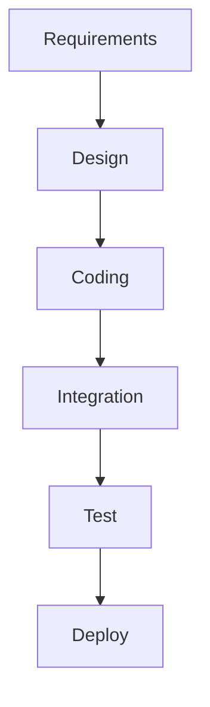
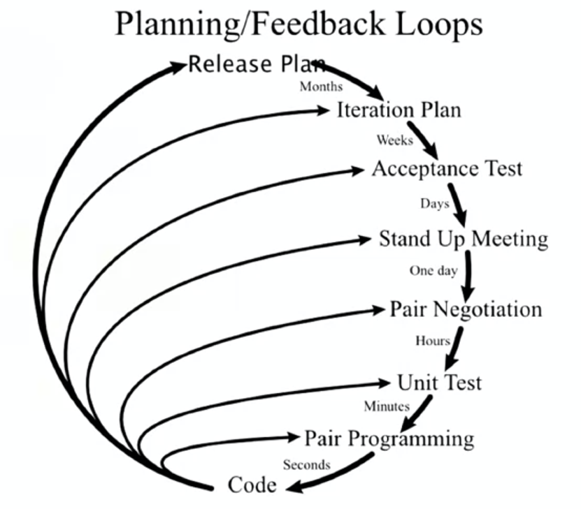

# **Introduction to agile philosophy**

## **Agile principles**
### <ins>What is Agile?</ins>
- Agile is an iterative approach to project management that allows teams to be responsive and deliver value to their customers faster.

- Unlike other planning approaches where we plan out an entire year's worth of work, with Agile we plan out small increments and they get feedback from the customer to see if they like what we're doing then making possible to adjust as we go along.

### <ins>Agile defining characteristics</ins>
- Agile emphasizes:
    
    - Adaptive planning which we don't plan out an entire year, but a small iteration to see if we can deliver something of value to the customer, get feedback and see what they like, allowing us to do evolutionary development.

    - Evolutionary development that will evolve over time. We are building... instead of building the whole thing up at once, we are building it in small increments and then evolving and responding as we go. This gives the opportunity to do early delivery.

    - Early delivery is a key component of being agile, in other words, if you are developing iterations and not delivering to the customer, you are not being agile. Putting something in the customers' hands, getting feedback from them to understand and see what they liked, should we pivot, should we persevere? This is a critical defining characteristic of being agile, over just doing iterative development.

    - Countinuous improvement is done as team. We continuously improve the product that we are delivering because we have the opportunity to get feedback from our customer, because we delivered it. This allow us to be responsive to change. So as changes happen (they always do), customers always have changing requirements. We can respond to those changes, because we haven't planned too far in advance, the customer sees the progress we have made and then we can quickly re-plan and be responsive to what a customer needs.

### <ins>Agile manifesto</ins>
- We have come to value:

    - **Individuals and interactions** over processes and tools
    - **Working software** over comprehensive documentation
    - **Customer collaboration** over contract negotiation
    - **Responding to change** over folowing a plan

> While there is value in the items on the right, we value the items on the left more. 
> 
> It does not mean we do not have processing tools, it just means that we value interacting amongst ourselves and with our customers more than the process and tools.
>
> It does not mean we do not document (it is important so that people understand how to use the product), but we can not ship documentation.
>
> Working software is what we are here to deliver. It does not mean that we don't negotiate contracts, we still have contracts, but we want to collaborate with the customer.
>
> As things change, we want to be responsive, which does not mean that we do not have plans, but we value responding to change over simply following the plan.

### <ins>Agile software development</ins>
- Is an interative approach to software development consistent with the Agile Manifesto.

- Emphasizes flexibility, interactivity (with peers and customer) and a high level of transparency, so that everybody knows what everyone else is working on and feels responsible for delivering value to the customers.

- Uses small, co-located, cross-functional, self-organizing teams.

### <ins>Key takeway</ins>
- Build what is needed, not what is planned. If you build what was planned and the customer does not like it, why bother? It is important to make sure that as they need change, you want to build what is needed from the customer regardless of what was planned. We can always replan and be responsive to change.

## **Methodologies overview**

### <ins>Traditional waterfall development</ins>

- Requirements: people are gathering requirements, seeing what the customer wants, making sure that we are going to deliver something that the customer wants. At least for that point in time. In short, this is a phase where all you are doing is documenting all the requirements of the customer might want in the system.

- Design: happens after getting all the requirements. The architects are designing, figuring out how do we take those requirements, turn them into working software. And so, they design the entire system.

- Coding: this phase is where the developers are coding away.

- Integration: all along, the coding phase was made in isolation and we are not integrating my module with the next person module, but there is a time when all the modules come together and then comes the question: "Do all these pieces of code even work together?". Then comes the testing phase

- Test: with a system that people can test, bugs are found, they go back and open some bugs in the coding phase and do some recoding. However it would be extremely hard to change anything if one of those bugs that they tested turns out to be a change in the design because nothing is interacting well.

- Deploy: Goes to production and is available to the customer.

> In a waterfall development, there is a exit and entrance criteria to move from on phase to the other and once you are in the coding phase, for example, and find out that the design is bad, it is real hard to go back up and redesign thing. In fact, because the software development is treated the same way as a civil engineer project, sometimes some of those designers have moved on to the next project, and you have got to find them. So it is very dificult to go back a phase in a waterfall development.

### <ins>Problems with the waterfall approach</ins>
- No provision for changing requirements. Every phase has entrance and exit criteria and when one ends, the next on begins. Also there is no provision for going back and changin the design or changing the requirements.

- No ideia if it works until the end, there is no intermediate delivery. Nothing is delivered until the last step, where we give to the operations team and say "go deliver this to prodution".

- Each step ends when next begins and each and every phase is an opportunity to lose information, have a mishap happen or to have people get blocked, because they can not accept the work from the previous phase and you are waiting to get the next phase going.

- Mistakes that are found later on are very costly. To find something that is designed wrong and testing and go back and redesign it.

- There is the long lead time, right between getting that sofware delivered. From the time you first want the software and you design, code, test it and, by the time it is delivered, there is a long lead time.

- Teams work separetely, unaware of their impact on each other. The designers, for example, are unaware of the impact of the code, the coders are unaware of their impact to integrating all the code together. In this approach, everybody is working in their little silos for their little phase. With this, people who are furthest away from a code, the operation team, have to run and manage the software in production (they know the lease about the code and are expected to run it).

### <ins>Extreme programming (XP)</ins>
- Kent Beck introduced Extreme Programming in 1996

> The graphic is very iterative and talking about loops. You've got these major release plan on the outer loop, then an iteration plan and so the release maybe months, the iterations maybe weeks, acceptance has maybe days, stand up meetings once a day, pair negotiation in hours, unit test in minutes, pair programming in seconds. It is tighter loops of doing work and getting feedback.

- It is based on iterative approach to software development and the intent is to improve sofware quality, be responsive to change, be responsive to customer requirements, do things in small increments.

- Extreme Programming can also be considered one of the first Agile methods.

### <ins>Extreme programming values</ins>
- Simplicity: keep it simple and do what you need and no more. Do not over-engineer, do not over code, do not deliver more code than the customer asked for.

- Communication: everyone on the team should be communicating to know what everyone else is doing.

- Feedback: the feedback loops are critical to extreme programming, and critical to Agile in general, since you have no idea how you are doing unless you are getting feedback.

- Respect: everyone feels that they are respected on the team, that they can offer advice that they can make suggestions and that their suggestions are just as valuable as anybody else's suggestion on the team. There is no hierarchy, everybody has peers on the team and respected for their ideas.

- Courage: be honest about your thoughts and the amount of work you can do without lying to overestimate yourself.

### <ins>Kanban</ins>
- Means billboard sign and it is all about continuous flow on the manufacturing floor, where these cards or notes would flow with the product from station to station, going down the line. The principle with this is to visualize the workflow

### <ins>Core principles of Kanban</ins>
- Visualize the workflow
- Limit work in progress (wip)
- Manage and enhance the flow
- Make process policies explicit
- Continuously improve

## **Working with Agile**
### <ins>Working Agile</ins>
- Working in small batches. Using lean manufacturing as an example, you do not want to make a batch of something and then find out that you did it wrong because that's a lot of wast having to go back and change it.

- Use minimum viable product (MVP) to figure out what does the customer like, what doesn't the customer like.

- Use practices like Behavior Driven Development and Test Driven Development to improve your testing of the system from the outside in and from the inside out.

- Take advantage of pair programming. This came from extreme programming, but pair programming is critically important.

### <ins>Working in small batches</ins>
- You need to mail 1000 brochures:
  - Step 1: fold brochures
  - Step 2: insert brochures into evelopes
  - Step 3: seal the envelopes
  - Step 4: Stamp the envelopes with postage

- Working in batches of 50 brochures
  - Assume each step takes 6 seconds to complete (10/min)
  

  - What if the envelopes had no glue?
  - What if there were a type in the brochure?

### <ins>Single piece flow</ins>
- Working in batches of 50 brochures:
  - Assuming each step takes 6 seconds to complete
  

  - What if the envelopes had no glue? Could be easily found out
  - What if there were a type in the brochure? Would be evident at the end of the first finish product in 24 seconds

> It is very important that we don't work in two larger batches so that we can get fast feedback and that we can pivot and understand we need something different and then make the changes that we need to make.

### <ins>Minimum Viable Product</ins>
- Minimum Viable Product (MVP) is not the result of "Phase 1" of a project, the first beta or something like that.

- **Minimum Viable Product (MVP) is the minimum thing that you can do to prove a hypothesis and gain learning and gain understanding**.

- There difference between these two items is that the first one is all about delivery "What am I going to deliver?", but the second on is all about learning "What can I learn?" and "What can I learn from putting out this MVP and get feedback and then maybe make the next one even better?". So it is important that at the end of each MVP you decide whether to pivot or persevere.

- Example: Here's a team that's developing a minimum viable product for a customer that wants a car. And so, in the first iteration, they deliver a wheel. The customer's like, "What am I going to do with a wheel? I can't do anything with this?" Like, well, we're working iterations, we're trying to be agile here, right? And so the next iteration, we'll give you some more. And they give them a chassis and it's like, okay, "I really can't do anything with this." And then finally, you know, they give them a car with no steering wheel and then eventually they get the car, right? And so they get this coupe. That team did not understand how to create a minimum viable product. They were just doing iterative development. The second team understands the value of creating an MVP. At first, they give them a skateboard and the customer's like, "I asked you for a car and you're giving me a skateboard." Whoa, whoa we're testing the color. How do you like that color red? Is that the color you want? "Oh yeah, red's kind of cool but you know it's really hard to steer." No, we'll fix that in the next MVP and then they add a way to steer it and the customer's like, "Well, okay, you did give me a way to steer it but I can't go very fast. I need a better form of locomotion." And then we'll deal with that in the next MVP. In the next iteration, they give them pedals. Somewhere along the way while the customer is riding on that motorcycle feeling the wind in their hair they decide, "I want a convertible." In the first instance, the customer got exactly what they asked for months before because they were just following a plan but in the second instance the customer got exactly what they desired because they were working interactively with the development team and in the end, you develop something that's a little bit different but it's closer to what the customer really, really wants.

### <ins>Behavior Driven Development (BDD)</ins>
- Behavior Driven Development is when we describe the system from the outside in. This is usually done at an integration testing level.

- This is where we are taking the customer's view of the system. Usually when you are doing BDD testing, you are doing it against the user interface; you are doing it against the thing that the customer sees to see if the system behaves the way it is supposed to. So, if it is an e-commerce system, when I put something in my cart, does it behave the way I want? When I transfer a cart to an order, does it behave the way I want? It is really taking an outside-in approach. It is not too concerned with the things going on underneath.

- It uses a single syntax that both the developers and the stakeholders can use to describe the system and agree on the behavior of the system, on what the system does.

### <ins>BDD feature scenarios</ins>
- "As a < role >. I need some < function >. So that < some business value >"

- So, now you know who is it for. Is it for the customers? For the system administrator,? Who's getting the value out of this what do they need and why do they need it? And that's the beginning of your feature file. And then you start running through scenarios and here's where we use this common syntax known as Gherkin syntax, after the Gherkin pickle. And it goes something like this:
  - Given a set of preconditions (sets up the scenario - given that this is true)
  - When some event occurs (the thing that is under test)
  - Then some outcome is observable

> Using this <ins>given when-then</ins> syntax, developers can understand it, stakeholders can understand it, everybody can understand this common syntax that when I have something in my cart, for example, and then I clear my cart, I should see nothing in my cart. So very, very important to have the syntax in these BDD scenarios.

### <ins>Test Driven Development (TDD)</ins>
- Test driven development is testing a system from the inside out. Unlike Behavior Driven Development, TDD is concerned with the internals of the system, the single modules. Usually this is called unit testing and is something that is unit test case driven and we want to make sure that given these inputs I get these outputs at a small module level.

- It is not known if when I put them all together I am going to get the behavior I want, that is BDD, but for TDD I am just testing the system way down at the unit level and so a test case is written first for the code you wish you had and then you write enough code to make that test case pass, and then you start all over again and refactor. This should be the workflow for TDD:
  - I write a test case: it is done before the code. This keeps you featured on what the code is supposed to do, how you want to call it, what are the parameters and what does it do.
  - So you write the test case first, then you write the code to make that test case pass and then, once it passes, then you can refactor the code because now you have test cases to keep it honest.

- Because when the test case runs and it fails, it usually turns red and then when it works correctly it turns green. This is called Red, Green, Refactor -> whatch a test case, write a test case, watch it fail, make just write enough code to make it pass and then refactor.

### <ins>Pair programming</ins>
- Two programmers work together at on workstation
  - One writes the code
  - The other reviews each line of code as it is typed in.

- Having two sets of eyes, they check each other and they go back and forth, making it possible to find bugs while writting the code. But this is not just one and then the other. The two programmers switch roles fequently (e.g. 20 minutes).

- Code quality increases as defects are found earlier.

- It is a good practice to pair a senior programmer with a junior programmer. This make it possible for a junior programmer to see how a senior programmer approaches the problem. So they learn, they get mentorship, and then the senior programmer can see how the junior person is making out. Or you get prople who are unfamiliar with the code working with someone who is and, with this, you get more people learning the code.

# **Introduction to scrum methodology**

## **Scrum overview**

### <ins>Agile and Scrum</ins>
- There is a difference between agile and scrum, but they are words that many people use interchangeably.

- Agile is a phylosophy, not perscriptive. It is a philosophy for doing work.

- Scrum is methodology, a perscriptive (adds process). It is a methodology for working in an agile fashion.

### <ins>Scrum</ins>
- **Scrum is a management framework for doing incremental product development emphasizing small, cross functional, self managing teams providing structure of roles, rules and atifacts. It uses these fixed length increments that are called sprints and has a goal of building an increment each time through a sprint, a potentially shippable increment each time through that interation.**

### <ins>Sprint</ins>
- A sprint is one iteration through the design, code, test and deploy cycle. It is kind of like the software delivery lifecycle in a mini inner iteration.

- Every sprint should have a goal. In other words, everybody should understand what is it we are trying to build with this increment. What should this increment do at the end of the sprint?

- Sprints are usually 2 weeks in duration

### <ins>Steps in the Scrum process</ins>

-  Product backlog: this is the list of all the stories of everything you ever want to do with your product, like a to-do list of everything you might want to do.

- Backlog refinement: it is when we go through the product backlog and groom the stories to make sure that they are sprint ready because we want to start doing planning on those stories.

- Panning meeting: where we produce a sprint backlog. An observation is that the sprint backlog is smaller than the product backlog. The sprint backlog is just those stories that we want to accomplish in the next sprint, in the next two weeks. 

- So we take from that product backlog, pare it down into a sprint backlog of just the stories to execute in the next sprint and start the two weeks sprint. And every day we get together and do the daily Scrum or the daily stand-up where everybody gets to answer three questions.
  - What did you do yesterday?
  - What are you going to do today?
  - Is there anything blocking you or impeding you from getting up further?

- So you go through that every day for two weeks, build your sprint and then, hopefully, you've got a valuable shippable increment at the end of that process.

### <ins>Agile developement is iterative</ins>

- You are going through the steps of design, code, test, deploy repeatetly and, with each iteration you get some king of feedback.

- In every sprint you make a plan, you go through the software delivery lifecyle cycle and then you deploy that application and get some feedback from the customer that is input to the next plan to go through the next cycle.

## **The 3 roles of Scrum**

### <ins>Scrum roles</ins>
- Product Owner: the person who has the vision and the one who calls the shorts. They are the ones who decides to pivot or persevere. But what is the difference between a product owner and a product manager? A product manager is a job title while a product owner is a Scrum role. Your product manager might be your product owner, or not. In essence, is a Scrum role.

- Scrum master: they are the mentors, the ones who are the smartest about Scrum on the team to help the rest of the team implement Scrum. Is somebody that you want to be guiding the team. Highly recommended if the team is not an experienced team.

- Scrum team (development team): are people who are developing whatever it is you are delivering. They could be software engineers, testers, operations folks, business analysts, whoever it is that is part of the team that is delivering the product increment.

### <ins>Product Owner</ins>
- Represents the stakeholder interests (if there is any doubt about what the stakeholder wants, the product owner should know)

- It is the person with the checkbook, the person who is funding whatever it is that you are doing. They are the one at the end of the day that are paying you to do it.

- Is a liaison between the Scrum team and the stakeholders and their interests

- They also articulate the product vision and have to have a vision of where they are going. And when and they should articulate that vision to the team, so the whole team knows where they are going.

- They are the final arbiter of requirements or questions and constantly reprioritize the product backlog, adjusting any expectations. So every time, through a sprint, we go through the product backlog and the product owner, maybe the Scrum master, will go through the product backlog, reprioritize and groom these stories and gitve them more details.

- The job of the product owner is to make sure that the backlog is sprint ready and accept, or reject, each product increment. They decide whether to continue development or pivot.

### <ins>Scrum master</ins>
- Facilitates the scrum process. They should be the smartest person in the room about Scrum. It is very important to have an experienced Scrum master if you have an inexperienced team. if you have a very experienced team in Scrum, you might not need a very experienced Scrum master. Or you might have a Scrum master between a couple of teams that are experienced because they don't need a lot of his time.

- They coach the team (the are Agile coaches). We want them to be mentors, we want them to help the team through the Scrum process. They create an environment that allows the team to be self organizing so the team decides what they do. They are the ones that are going to commit to a sprint increment and has to make sure that the team has the ability and the environment in which they can do that and be self-organizing. They also shield the team from external interferences like if the customers are grabbing team members or stakeholders, or calling team members. Basically, the Scrum master says "If you need something, you come to me. Let the team alone and work on what they need to work".

- They also help resolve impediments. If there is any impediment to complete any work described on a daily stand up, it is the Scrum master's highest priority that day to get them inblocked, to remove the impediment. It is very different than traditional project management, where a project manager just asks what you will do about an impediment. Basically, the Scrum master will take over the impediment to fix it and you will move on to some more productive work.

- They enforce the sprint time boxed, for example, if a there is only 15 minutes for a daily stand-up, it is their job to make sure it stays 15 minutes and the two week sprint is not longer than those two weeks.

- They capture empirical data, maybe just forecasts. So they are the one who's making sure, loking at burndowns charts and making sure that the team is going to reach their goals. And they should have no management authority over the team, but be someone that the team can confide in.

### <ins>Scrum team</ins>
- This is a cross-functional team, consists of developers, testers, business analysts, domain experts, operations people, if you're doing DevOps.

- The Scrum team is self-organizing, self-managing, and they self-assign themselves work. There's no externally assigned roles. Everybody is equal and has the same role. 

- The Scrum team pulls the work off of the kanban board, assigns it to themselves and starts working on it. In short, they are self-managing. However they shouldn't be too large. A Scrum team is around seven people with 2, one more or less, collaborative members. 

- They should be co-located, if at all possible. They are most successful when they're co-located. They just are more successful when together, hopefully in the same team room, but if they can't be and has to be geographically dispersed, put at least two members in a geography or time zone so that they can collaborate together. And then maybe I'll have other two people in another timezone. Don't just stick one person alone in a time zone, they kind of get forgotten about. You need people to collaborate with.

- They're dedicated. Most successful teams have long-term, full-time members. They're not on multiple projects. They're not getting pulled off for other projects. You do not want to have people on multiple projects, you want them to be dedicated if you want to be a high performing, successful team.

- They negotiate commitments with the product owner, one sprint at a time. They're not committing for what they're going to do down the road. They're not committing in January for what they're going to do in September, they're going to commit. "What am I gonna get done in the next two weeks?" And they've got a ton of autonomy on how to reach those commitments. So, they're not told how to do something. They're told what needs to get done, and then get out of their way. You hired good people, let them do their thing and let them figure out how to get that thing done.

## **Artifacts, events and benefits**

### <ins>Scrum artifacts</ins>
- Product backlog: this is a list of all the stories you're ever going to do. It's all your requirements for the product that haven't been done yet so any stories that not in the current sprint are in the product backlog. Some teams have the product backlog, an icebox and a release backlog.

- Sprint backlog: are the stories that you're going to do in the next two weeks in the sprint. So those are stories that are kind of on deck to be executed.

- Done increment: is product increment that is completed by the end of a sprint.

### <ins>Scrum events</ins>
- Sprint planning meeting: where you get together to plan out the sprint. In that meeting, you'll have the product owner and the Scrum master and the entire team planning out what to do next; where the team commits to the stories that they are going to fulfill in the next sprint.

- Daily scrum meeting (a.k.a. daily stand-up): it happens every day, usually in the same place, same time, where they meet to kind of syncrhonize on how things are going, what the team will work on that day and if there are any impediments that can be relieved by the Scrum master.

- Sprint review: it is when you demonstrate what you have done to the stakeholders so they could see the advancements that you've gotten, the new features that you've put in the product.

- Sprint retrospective: is where the team reflects on what went well, what did not and what can be changed for the future.

### <ins>Scrum benefits</ins>
- Higher productivity: when everybody is meeting ever day to understand what to do when we've got a Kanban board, with all our work in progress, everyone can see what everyone's working on. It lends itself to higher productivity, because people are kind of self-managing and being very productive. 

- Better quality: better software quality because the team is engaged in what they are doing. They are running tests, they are using behavior driven development, they're using test driven development and getting higher quality out of their, out of their code that they are writing because they are constantly testing it.

- Reduced time to market: because you are working with small increments and getting something done. In other words, you get a done increment sonner than you can then put out, have customers test enjoy.

- Increase stakeholder satisfaction: because they are not waiting months to see if whatever you build is what they want, but get to see it much quicker.

- Better teams dynamics: because it is transparent. Everyone knows what everyone is working on. Everybody chips in when somebody gets stuck. It is a better and productive environment for developer to work in.

- Happier employees: they understand they are in control and are pulling things off the backlog. They are commiting to a sprint, one sprint plan at a time, and so they feel more in control and happier about their jobs.

### <ins>Scrum vs. Kanban</ins>

|                     	|                                     **Scrum**                                    	|                **Kanban**                	|
|---------------------	|:--------------------------------------------------------------------------------:	|:----------------------------------------:	|
| Cadence             	| Fixed length sprint                                                              	| Continuous flow                          	|
| Release methodology 	| End of each sprint                                                               	| Continuous delivery                      	|
| Roles               	| Product Owner, Scrum Master, Development Team                                    	| No existing roles (optional Agile coach) 	|
| Key metrics         	| Velocity (how much work can be done in two weeks)                                	| Cycle time                               	|
| Change philosophy   	| Teams should strive to not make changes to the sprint forecast during the sprint 	| Change can happen any time               	|

# **Organizing for success**

## **Organization impact of Agile**

### <ins>Organize for success</ins>
- Proper organization is critical to sucess

- Existing teams may need to be reorganized in order to take full advantage of becoming agile.

### <ins>Conway's law</ins>
- "Any organization that designs a system (defined broadly) will produce a design whose structure is a copy of the organization's communication structure." (Melvin Conway, Datamation, 1968).

- Example: If you ask an organization with four teams to write a compiler -> you will get a 4-pass compiler.

### <ins>How teams should be aligned</ins>
- Teams are loosely coupled, tightly aligned. You want them to be loosely coupled and you don't want a lot of dependency between teams, but you want the teams to be aligned, because they are building a single application. 

- Then each team has its own mission, which should be aligned with the business (like a mini startup). If a e-commerce was developed with 50 developers, they should not be together in one big team like when working in a monolith pattern, but break them up into smaller teams with ownership of the business area (an order team, an accounts team, a shopkart team and a recommendation team for instances). 

- Each team should have end-to-end responsability, since you want them to build the application, run it and debug it in production.

- The team should have a long term mission. The long-term mission is usually around a single business domain.

### <ins>Autonomy is important</ins>
- It's motivating - and motivated people build better stuff.

- It's fast - decisions happen locally in the team leavel rather than waiting for decisions to come down on high.

- It minimizes handoffs and waiting, so teams don't get bogged down. The get to make their own decisions and get to run at their on speed.

### <ins>The agile dilema</ins>

- This graphic, the wall of confusion, was made famous by Andrew Clay Schafer, but it's all about the diametrically opposed metrics that we use with development and operations. Development wants change, they are measured on getting new changes out into production. Whereareas operations are measured on stability. 

- These are diametrically opposed views.

### <ins>The entire organization must be Agile</ins>

- The organization doesn't become Agile. It doesn't metter that your development team is Agile, if the DevOps team is not.

- In this case, the project was waiting for a ticket to be completed so the application could be deployed.

### <ins>Agile + DevOps = Aligment</ins>
|     **The goal of Agile**     	|                                 **The goals of DevOps**                                 	|
|:-----------------------------:	|:---------------------------------------------------------------------------------------:	|
| Develop software faster       	| Accelerate time to market                                                               	|
| Be responsive to changes      	| Improve IT's value by more closely aligning development, IT operations and the business 	|
| Obtain higher quality results 	| Increase IT productivity                                                                	|

## **Mistaking iterative development for Agile**
### <ins>Overview</ins>

- Agile is more than just iterative development and describe what Agile is not.

- Following is a pitfall that a lot of organizations fall into
  - They claim that they are Agile and start a new project. So they've got this studying and approval going on this design and planning. This is the "fuzzy front end".

    

  - They are doing the waterfall process and just building requirements. In short, they are doing a lot of planning, upfront stuff that doesn't really seem Agile, then they get it doing the actual development.
  
  - They are also being iterative. They are iterating on the plan, but just that and nothing else. They are not stopping at the end of each iteration to get feedback from the customer because they haven't deployed anything. They are not stopping at the end of each iteration and asking "Should I pivot or persevere?". In short, they are just following a plan iterating.
  
  - There is also the last mile where they are trying to deploy it and it takes forever to deploy because nobody's ever deployed before. This is the first time everything's been intergrated together.

    
  
  - They are just doing waterfall with they think they're doing a Scrum in the middle. They are not really doing Scrum, but they are just doing iterative development.

  - This is a pitfall a lot of companies fall into, not being Agile. If a company is doing all this planning upfront, they're not being Agile, they're not going to be responsive to change, they're not going to be getting fast feedback unless they're deploying quickly.

### <ins>Agile is not...</ins>
- Agile is not a new version of a waterfall software development life cycle (SDLC) where you do legacy development in sprints.

- Agile is not just the developers working in each sprint. It involves a cross-functional team.

- The Agile manifesto does not include the term "Agile project management" (and so there are no "project managers" in Agile).

# **Planning to be agile**

## **Destination Unkown**
### <ins>Deadlines</ins>
- "I love deadlines... I like the whooshing sound they make as they fly by" (Douglas Adams)

- How to avoid missing a deadline?

### <ins>Plan iteratively</ins>
- Don't decide everything at the point when you know the least. In other words, at the beginning of project, we know practically nothing, or very little about the project and this is the moment the planning stage happens. So, we should not decide everything in the beginning, when we know the least, but plan for what you know and then adjust the plan as you move along. In short, do iterative planning, what Agile is all about.

- Your estimates will be more accurate, because the shorter time to plan, the more accurate the plan will be.

> Don't try to be omnipotent an plan everything up front, but plan as you go and as you learn more, than you could add more to the plan and get greater estimates.

## **Agile Roles and the Need for Training**
### <ins>Formulas for failure</ins>
- Product manager becomes product owner: placing prople in a new role without giving them training. (Product manager is a job title and product owner, a scrum role. They may, or may not, be the same person)

- Project manager becomes the scrum master with no training on how to be the scrum master.

- Developers (alone) become scrum team. Developers alone are just the software engineers, so there are no tester, or ops people, or business analyst on the team.

### <ins>Product manager vs product owner:</ins>

|                          **Product manager**                         	|                                        **Product owner**                                       	|
|:--------------------------------------------------------------------:	|:----------------------------------------------------------------------------------------------:	|
| Business person who manages the budget                               	| Visionary who leads the team in a series of experiments designed to achive the sprint goal     	|
| Manager who is mostly focused on operational aspects of the business 	| Conduit between the stakeholders and the team, tranlating between business and technical goals 	|

### <ins>Project manager vs scrum master:</ins>

|                   **Project manager**                   	|                        **Scrum master**                        	|
|:-------------------------------------------------------:	|:--------------------------------------------------------------:	|
| Task master who keeps everyone marching to a fixed plan 	| Coach that keeps the team focused on the current sprint        	|
| Documents impediments as project risks                  	| Eliminates impediments while buffering team from interruptions 	|

### <ins>Development team vs scrum team:</ins>

|       **Develop team**      	|                                               **Scrum team**                                              	|
|:---------------------------:	|:---------------------------------------------------------------------------------------------------------:	|
| Consists only of developers 	| Cross-functional team that includes developers, testers, security, business analysts, operations and more 	|

> "Until and unless business leaders accept the idea that they are no longer managing projects with fixed functions, timeframes and costs, as they did with waterfall, they will struggle to use agile as it was designed to be used" (Bob Kantor, Founder Kantor Consulting Group, Inc.)

### <ins>The roles have changed</ins>
- You cannot put people in new roles without the proper training and mindset, otherwise, a project manager, for instance, will use his/her own knowledge to do something. An example would be turning a combine board into a Gantt chart.

- This mindset must come down from upper management. They cannot ask to predict things way far into the future. Instead of asking what you are going to get done by the end of year, they should be saying what are you going to do in the next two weeks? How are you going to delight my customers at the end of the next sprint?

## **Kanban and Agile Planning Tools**